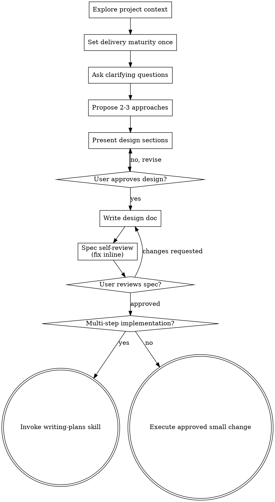

# Brainstorming Ideas Into Designs

Help turn ideas into approved designs through proportionate collaborative dialogue.

Start by understanding the current project context and delivery target. Ask only questions that can materially change the design, then present the design and get user approval.

<HARD-GATE>
Do NOT invoke any implementation skill, write code, scaffold a project, or take implementation action until you have presented a design and the user has approved it. Scale the design to the change: a precise small change may need only a compact design summary, while a large or ambiguous change needs the full dialogue below.
</HARD-GATE>

## Delivery Maturity

Decide delivery maturity once near the start, using project context when it already provides the answer:

- **V1 usable / prototype / internal tool:** prioritize the approved user flow and defer non-blocking production hardening.
- **Production hardening:** include the reliability, operability, scale, and threat-model work required by the stated target.
- **Project-provided equivalent:** use the project's explicit phase or release policy instead of inventing a new label.

If maturity is unclear, ask one question to resolve it. Do not reopen delivery maturity later unless the human partner explicitly changes the target.

For V1-usable work, only these concerns remain blockers in the active design discussion:

- behavior that will deterministically fail the primary flow (**deterministic correctness**);
- realistic loss or corruption of user data (**data corruption**);
- an immediate exploitable exposure in the approved flow (**direct security risk**).

Put extreme scale, rare external failures, long-term operations, and other non-blocking production hardening into a concise follow-up list; defer it to a later version instead of repeatedly asking boundary questions. Delivery maturity changes depth, not scope: never remove a function the human partner already approved.

## Checklist

Track these items in order, combining them when the change is small:

1. **Explore project context** — check files, docs, recent commits
2. **Set delivery maturity** — infer it from project facts or ask once
3. **Offer the visual companion just-in-time** — only when seeing the choice is genuinely clearer than reading it
4. **Ask high-value questions** — one at a time; skip questions already answered by project facts or prior approval
5. **Compare viable approaches** — use 2-3 options when there is a real architectural choice
6. **Present design** — in sections scaled to complexity, with approval after each substantive section
7. **Write and commit the design doc** — save to `docs/superpowers/specs/YYYY-MM-DD-<topic>-design.md`
8. **Self-review and obtain written approval** — fix placeholders, contradictions, ambiguity, and scope drift first
9. **Transition proportionately** — small work may execute directly; multi-step work invokes writing-plans

## Process Flow

Do not invoke implementation skills before written design approval. After approval, invoke writing-plans only when the implementation has multiple logical batches; otherwise use the relevant implementation and verification skills directly.

## The Process

**Understanding the idea:**

- Check out the current project state first (files, docs, recent commits)
- Determine delivery maturity once from existing project facts, asking only if it is genuinely unknown
- Before asking detailed questions, assess scope: if the request describes multiple independent subsystems (e.g., "build a platform with chat, file storage, billing, and analytics"), flag this immediately. Don't spend questions refining details of a project that needs to be decomposed first.
- If the project is too large for a single spec, help the user decompose into sub-projects: what are the independent pieces, how do they relate, what order should they be built? Then brainstorm the first sub-project through the normal design flow. Each sub-project gets its own spec → plan → implementation cycle.
- For appropriately-scoped projects, ask high-value questions one at a time to refine the idea
- Prefer multiple choice questions when possible, but open-ended is fine too
- Only one question per message - if a topic needs more exploration, break it into multiple questions
- Focus on understanding: purpose, constraints, success criteria, and primary failure modes
- Record non-blocking production hardening without expanding the active V1 discussion

**Exploring approaches:**

- Propose 2-3 different approaches when more than one viable approach exists
- Present options conversationally with your recommendation and reasoning
- Lead with your recommended option and explain why

**Presenting the design:**

- Once you believe you understand what you're building, present the design
- Scale each section to its complexity: a few sentences if straightforward, up to 200-300 words if nuanced
- Ask after each section whether it looks right so far
- Cover: architecture, components, data flow, error handling, testing
- Be ready to go back and clarify if something doesn't make sense

**Design for isolation and clarity:**

- Break the system into smaller units that each have one clear purpose, communicate through well-defined interfaces, and can be understood and tested independently
- For each unit, you should be able to answer: what does it do, how do you use it, and what does it depend on?
- Can someone understand what a unit does without reading its internals? Can you change the internals without breaking consumers? If not, the boundaries need work.
- Smaller, well-bounded units are also easier for you to work with - you reason better about code you can hold in context at once, and your edits are more reliable when files are focused. When a file grows large, that's often a signal that it's doing too much.

**Working in existing codebases:**

- Explore the current structure before proposing changes. Follow existing patterns.
- Where existing code has problems that affect the work (e.g., a file that's grown too large, unclear boundaries, tangled responsibilities), include targeted improvements as part of the design - the way a good developer improves code they're working in.
- Don't propose unrelated refactoring. Stay focused on what serves the current goal.

## After the Design

**Documentation:**

- Write the validated design (spec) to `docs/superpowers/specs/YYYY-MM-DD-<topic>-design.md`
  - (User preferences for spec location override this default)
- Use elements-of-style:writing-clearly-and-concisely skill if available
- Commit the design document to git

**Spec Self-Review:**
After writing the spec document, look at it with fresh eyes:

1. **Placeholder scan:** Any "TBD", "TODO", incomplete sections, or vague requirements? Fix them.
2. **Internal consistency:** Do any sections contradict each other? Does the architecture match the feature descriptions?
3. **Scope check:** Is this focused enough for a single implementation plan, or does it need decomposition?
4. **Ambiguity check:** Could any requirement be interpreted two different ways? If so, pick one and make it explicit.

Fix any issues inline. No need to re-review — just fix and move on.

**User Review Gate:**
After the spec review loop passes, ask the user to review the written spec before proceeding:

> "Spec written and committed to `<path>`. Please review it and let me know if you want to make any changes before we start writing out the implementation plan."

Wait for the user's response. If they request changes, make them and re-run the spec review loop. Only proceed once the user approves.

**Implementation:**

- Invoke writing-plans for a multi-step implementation plan
- For an approved small task, proceed with the relevant implementation skill without creating a large plan or Goal

## Key Principles

- **One question at a time** - Don't overwhelm with multiple questions
- **One maturity decision** - Do not repeatedly reopen the release target
- **Multiple choice preferred** - Easier to answer than open-ended when possible
- **Preserve approved scope** - Defer hardening; do not delete requested functions
- **Explore real alternatives** - Do not invent options where the design is already constrained
- **Incremental validation** - Present design, get approval before moving on
- **Be flexible** - Go back and clarify when something doesn't make sense

## Visual Companion

A browser-based companion for showing mockups, diagrams, and visual options during brainstorming. Available as a tool — not a mode. Accepting the companion means it's available for questions that benefit from visual treatment; it does NOT mean every question goes through the browser.

**Offering the companion (just-in-time):** Do NOT offer it upfront. Wait until a question would genuinely be clearer shown than told — a real mockup / layout / diagram question, not merely a UI *topic*. The first time that happens, offer it then, as its own message:
> "This next part might be easier if I show you — I can put together mockups, diagrams, and comparisons in a browser tab as we go. It's still new and can be token-intensive. Want me to? I'll open it for you."

**This offer MUST be its own message.** Only the offer — no clarifying question, summary, or other content. Wait for the user's response. If they accept, start the server with `--open` so their browser opens to the first screen automatically. If they decline, continue text-only and don't offer again unless they raise it.

**Per-question decision:** Even after the user accepts, decide FOR EACH QUESTION whether to use the browser or the terminal. The test: **would the user understand this better by seeing it than reading it?**

- **Use the browser** for content that IS visual — mockups, wireframes, layout comparisons, architecture diagrams, side-by-side visual designs
- **Use the terminal** for content that is text — requirements questions, conceptual choices, tradeoff lists, A/B/C/D text options, scope decisions

A question about a UI topic is not automatically a visual question. "What does personality mean in this context?" is a conceptual question — use the terminal. "Which wizard layout works better?" is a visual question — use the browser.

If they agree to the companion, read the detailed guide before proceeding:
`skills/brainstorming/visual-companion.md`
